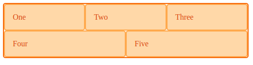
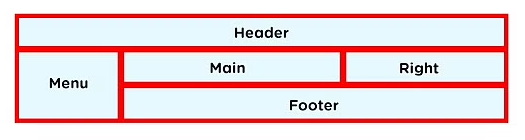
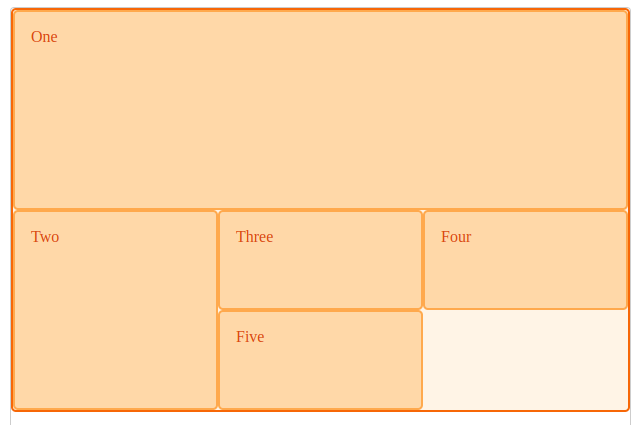

## Flexbox vs Grid

Flexbox is designed for alignment (align-items, justify-content) while Grid is designed for layout.

Flexbox is designed for one dimension i.e. row or column. Grid is designed for two-dimensional layout i.e. rows and columns at the same time. Flexbox also works from the content out i.e. spacing items evenly in a container by letting size of the content decide how much individual space each item takes up.

In terms of wrapping, Flex will wrap down onto another row when the flex items fills a row, while Grid will fall along the same grid line as of all other elements. If you are using flexbox and disabling some of the flexibility i.e. setting % width on a flex item to make it line up with other items in the row above, gird is likely to be a better choice.

Flexbox requires negative margins, transform or absolute positioning in order to break out of flex behavior, while Grid can place items on overlapping grid lines or within the same grid cells.

## Flexbox

Method used for space distribution between items in an interface with powerful alignment capabilities.

```
display: flex;
flex-direction: column;
align-items: flex-start;      Default is flex-stretch
justify-content: center;      flex-start, flex-end, space-around, space-between, space-evenly
flex-wrap: nowrap;

flex: 1 1 auto;               Grow, shrink, basis
flex-basis: auto;             Sets initial main size of flex item, else content size
flex-grow: 1;                 Cause items to stretch and take up any available space
flex-shrink: -1;              If postiive, can become smaller than flex-basis if insufficient space
```

### Wrap

When you wrap flex items, each new row/column is an independent flex line in the flex container. Space distribution happens across the flex line. If have uneven number of items, remaining items will not be aligned with the above items.

```html
<div class="wrapper">
    <div>One</div>
    <div>Two</div>
    <div>Three</div>
    <div>Four</div>
    <div>Five</div>
</div>
```

```css
.wrapper {
    width: 500px;
    display: flex;
    flex-wrap: wrap;
}
.wrapper > div {
    flex: 1 1 150px;
}
```

### Box Alignment

```css
.wrapper {
    display: flex;
    align-items: flex-end;
    min-height: 200px;
}
.box1 {
    align-self: stretch; /*Overrides default and stretch to the height of the container*/
}
.box2 {
    align-self: flex-start;
}
```



### Horizontal/Vertical Alignment

```css
.horizontal {
    display: flex;
    justify-content: center;
    align-items: center;
    align-left: auto;
    align-right: auto;
    text-align: center;
}

.vertical {
    line-height: 10px;
    align-top: auto;
    align-bottom: auto;
}

.right {
    float: right;
}
```

## Grid

Two-dimensional grid-based layout system with rows and columns. Useful for creating more complex and organized layouts.

The fr unit (fraction) works to assign a proportion of remaining space in the grid container to our grid tracks. When combined with minmax(), it can give us a similar behavior to the flex properties in flexbox while still enabling the creation of a layout in two dimensions.

https://learncssgrid.com/



### Explicit Grid

```
grid-template-rows: 50px 100px;              First row is 50px, second row is 100px, others are auto
grid-template-columns: 90px 50px;

grid-template-columns: 1fr 1 fr 2 fr;        Third item takes two units
grid-template-columns: 3rem 25% 1fr 2fr;     fr is calc. based on remaining space

grid-template-columns: minmax(auto, 50%) 1fr 3em;

grid-template-rows: repeat(4, 100px);
```

```css
.wrapper {
    display: grid;
    grid-template-columns: repeat(3, 1fr);
}
```

### Positioning Items by Grid Line Numbers

Grid lines are essentially lines that represent the start of, or end of, or between column and row tracks. Each line is numbered incrementally starting from 1. For instance, two-row and three-column grid will have three row lines and four column lines.

```html
<div class="wrapper">
    <div class="box1">One</div>
    <div class="box2">Two</div>
    <div class="box3">Three</div>
    <div class="box4">Four</div>
    <div class="box5">Five</div>
</div>
```

```css
.wrapper {
    display: grid;
    grid-template-columns: repeat(3, 1fr);
    grid-auto-rows: 100px;
}

.box1 {
    grid-column-start: 1;
    grid-column-end: 4;
    grid-row-start: 1;
    grid-row-end: 3;
}

.box2 {
    grid-column-start: 1;
    grid-row-start: 3;
    grid-row-end: 5;
}
```



### Positioning Shorthands

Can omit the end value if the area spans only one track.

```
grid-row: 2;                Shortcut for start and end
grid-column: 3 / 4;
```

### Spanning Items Across Rows and Columns

**Grid items span only one column and row by default**, but can span multiple row/column tracks using grid line numbers to position them.

```
// item takes up entire row
grid-column-start: 1;
grid-column-end: 4;

// item takes up entire column, assuming there are 4 items in total
grid-row-start: 1;
grid-row-end: 4;
```

### Box Alignment

For minmax(), if the total width of the items is less than the container, it will treat 1fr as maximum to share the remaining space between the items (similar to flexbox).

```css
.wrapper {
    display: grid;
    grid-template-columns: repeat(3, 1fr);
    grid-template-columns: repeat(auto-fill, 200px); /* grid will create as many 200px column tracks */
    grid-template-columns: repeat(auto-fit, minmax(200px, 1fr)); /* similar to flexbox with auto-width */
    align-items: end;
    grid-auto-rows: 200px;
}
.box1 {
    align-self: stretch;
}
.box2 {
    align-self: start;
}
```

### Gap

Sets the gap between rows and columns. Shorthand for row-gap and column-gap.

```css
gap: 20px;
row-gap: 20px;
column-gap: 20px;
```

### Contents

When nested items in a grid have css property of contents, the box it would normally create will disappaer and the boes of the child elements appear as if they have risen up a level i.e. children of a grid item become grid items.

```html
<div class="wrapper">
    <div class="box box1">
        <div class="nested">a</div>
        <div class="nested">b</div>
        <div class="nested">c</div>
    </div>
    <div class="box box2">Two</div>
    <div class="box box3">Three</div>
    <div class="box box4">Four</div>
    <div class="box box5">Five</div>
</div>
```

```css
.wrapper {
    display: grid;
    grid-template-columns: repeat(3, 1fr);
    grid-auto-rows: minmax(100px, auto);
}
.box1 {
    grid-column-start: 1;
    grid-column-end: 4;
    display: contents;
}
```
