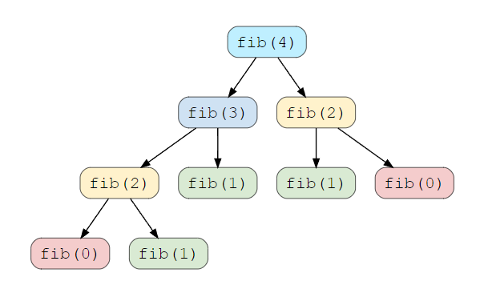

### Dynamic Programming (DP)

DP is mainly an optimization over plain recursion. Whenever we see a recursive solution that has repeated calls for same inputs i.e. overlapping subproblems, it can be optimized with DP.

Similarly to divide-and-conquer, dynamic programming solves problems by breaking it down into simpler subproblems and utilizing the fact that the optimal solution to the overall problem depends upon the optimal solution to its subproblems. Typically applied to optimization problems which can have many possible solutions i.e. finding the solution with min/max value.

Dynamic Programming solves the subproblems before making the first choice. Typically solve dynamic-programming problems in a bottom-up manner, progressing from smaller subproblems to larger subproblems. This only applies when subproblems share subsubproblems. When developing this algorithm, the sequence of steps are as follows:

1. Characterize the structure of an optimal solution.
2. Recursively define the value of an optimal solution.
3. Compute the value of an optimal solution, typically in bottom-up fashion.
4. Construct an optimal solution from computed information.

### Overlapping Subproblems

Any problem has overlapping subproblems if finding its solution involves solving the same subproblem multiple times i.e. fibonacci sequence.

```
fib(n) = fib(n-1) + fib(n-2)

n     Number of times fib() called
2     1
4     5
10    109
15    1219
```



### Top-Down with Memoization

In this approach, we solve the bigger problem by recursively finding the solution to smaller subproblems. When a subproblem is solved, the result is cached so that we don't end up solving it repeatedly if it's called multiple times.

``` 
fibMemoized(n) {
  fibResult = [0, 1]
  
  if n <= 1
    return 1
  else
    i = 2
    while i <= n
      fibResult[i] = fibResult[i-1] + fibResult[i-2];
    return fibResult[n]
}
```

### Bottom-Up With Tabulation

Avoids recursion by solving all related subproblems first. This is typically done by filling up an n-dimensional table. Based on the results, the solution to the original problem is then computed.
