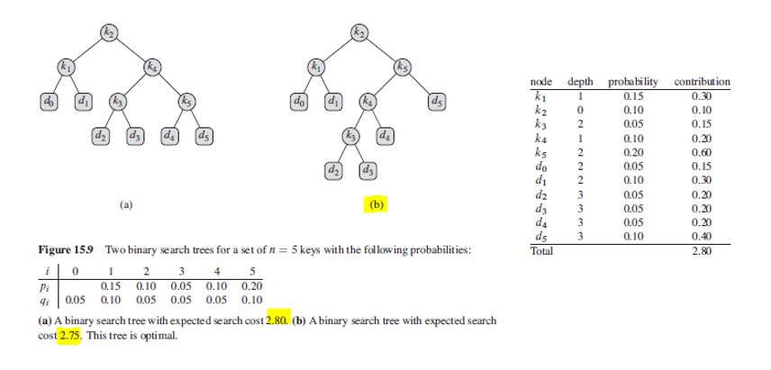
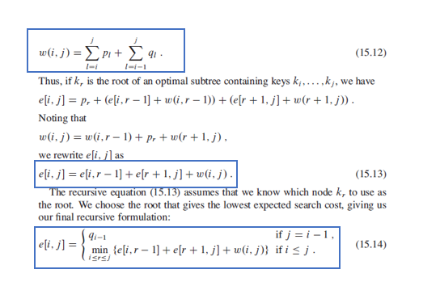
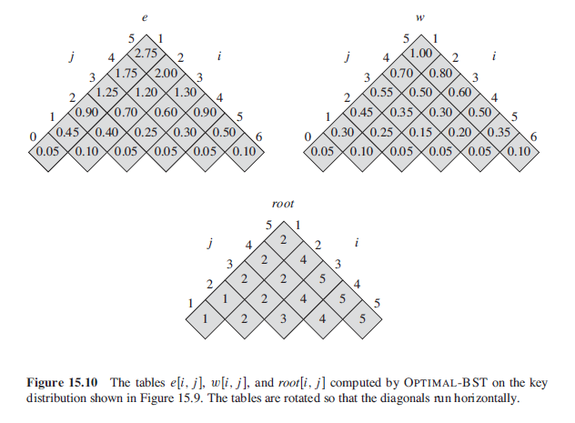

### Optimal BST

Suppose that we are designing a program to translate from English to French. For each occurrence of each English word in the text, we need to look up its French equivalent. This could be done using BST with French equivalents as satellite data. Nonetheless, as we are searching for each individual word throughout the tree, we want the total time spent searching (cost of search) to be as low as possible. Words with higher frequencies should be placed nearer towards the root, and vice versa.

An optimal BST is **NOT necessarily** a tree whose overall height is the smallest, nor has a root whose probability is the greatest. To minimize the number of nodes visited per search, we can design an optimal BST as follows:

- Given a sequence K = {K1, K2, ..., Kn} of n distinct keys in sorted order.
- Each key Ki has probability Pi that a search will be for Ki.
- Some searches may be for values not in K, so "dummy keys" are added with n+1 leaves.
- Di represents all values less than Ki, and Dn for all values greater than Kn.
- For each dummy key Di, it has a probability Qi that a search will correspond to Di.
- Summation of Pi and Di = 1.

```
searchCostKey = level of node * frequency/probability

searchCostBST = summation of searchCostKey for each key
```

#### Figure



### Recursive Solution for Optimal Substructure

- Subproblem domain as Ki, ... Kj where i >= 1, j <= n, j >= i-1.
- When j = i-1, there are no actual keys but dummy key D(i-1).
- e[i,j] to be defined as the expected cost of search.
- Need to compute overall e[1,n].

#### Formula

We try one by one all nodes as root (r varies from i to j). When rth node is made as root, the optimal cost from (i to r-1) and (r+1 to j) is recursively calculated. The sum of probabilities from i to j for both key nodes and dummies are also added as follows:
- summation of probabilities from i to j can be divided into two parts: probability of root + all other nodes except root.
- For each subproblem i.e. optCost(i, r-1) and optCost(r+1, j), we are choosing one node as root.
- In reality, the level of subproblem root and all its descendant nodes will be one level greater than the level of subproblem root.



### Final Solution

```
// p and q are arrays containing probabilities of nodes and dummies respectively
// computes rows in bottom-up fashion
// has time complexity of n^3

optimalBST(p,q,n) {
    // e,w, and root are tables/hashmaps
    // for e and w, the first index needs to run n+1 in order to have subtree containing Dn
    // second index needs to start from 0 to have subtree containing only D0
    e = [1..n+1, 0..n]
    w = [1..n+1, 0..n]
    root = [1..n, 1..n]

    for (i=1; i<=n+1; i++)
        // initialization
        e[i,i-1] = Qi-1
        w[i,i-1] = Qi-1
        
    for (k=1; k<=n; l++)
        for (i=1; i<=n-k+1; i++)
            // first iteration solves e[i,i] and w[i,i] i.e. tree containing one root
            j = i+k-1
            e[i,j] = -INFINITY
            w[i,j] = w[i, j-1] + Pj + Qj

            for r = i to j
                // tries each key as root
                // to determine which key should be used as root
                t = e[i, r-1] + e[r+1,j] + w[i,j]
                if t < e[i,j]
                    e[i,j] = t
                    root[i,j] = r
    return e and root
}
```

#### Figure


