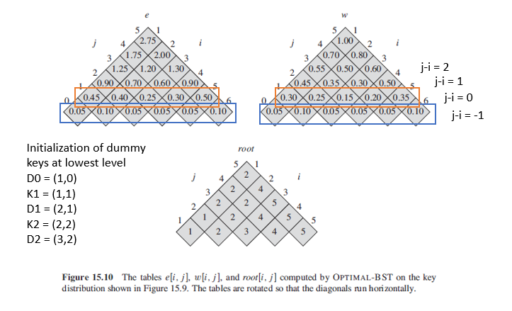

### Optimal BST

Suppose that we are designing a program to translate from English to French. For each occurrence of each English word in the text, we need to look up its French equivalent. This could be done using BST with French equivalents as satellite data. Nonetheless, as we are searching for each individual word throughout the tree, we want the total time spent searching (cost of search) to be as low as possible. Words with higher frequencies should be placed nearer towards the root, and vice versa.

To minimize the number of nodes visited per search, we can design an optimal BST as follows:

- Given a sequence K = {K1, K2, ..., Kn} of n distinct keys in sorted order.
- Each key Ki has probability Pi that a search will be for Ki.
- Some searches may be for values not in K, so "dummy keys" are added with n+1 leaves.
- Di represents all values less than Ki, and Dn for all values greater than Kn.
- For each dummy key Di, it has a probability Qi that a search will correspond to Di.
- Summation of Pi and Di = 1.

```
searchCostKey = level of node * frequency/probability
searchCostBST = summation of searchCostKey for each key
```

#### Figure


### Recursive Solution

- Subproblem domain as Ki, ... Kj where i >= 1, j <= n, j >= i-1.
- When j = i-1, there are no actual keys but dummy key D(i-1).
- e[i,j] to be defined as the expected cost of search.
- Need to compute overall e[1,n].

```
w(i,j) = summation of Pi + summation of Qi

e[i,j] = e[i, r-1] + Pr + w(r + 1, j)
// r refers to root
```

### Final Solution

```
// p and q are arrays containing probabilities of nodes and dummies respectively

optimalBST(p,q,n) {
    // e,w, and root are tables
    e = [1..n+1, 0..n]
    w = [1..n+1, 0..n]
    root = [1..n, 1..n]

    for (i=1; i<n+1; i++)
        e[i,i-1] = Qi-1
        w[i,i-1] = Qi-1

    for (l=1; l<n; l++)
        for (i=1; i<n-l+1; i++)
            j = i+l-1
            e[i,j] = -INFINITY
            w[i,j] = w[i, j-1] + Pj + Qj

            for r = i to j
                // to determine which key should be used as root
                t = e[i, r-1] + e[r+1,j] + w[i,j]
                if t < e[i,j]
                    e[i,j] = t
                    root[i,j] = r
    return e and root
}
```

#### Figure


