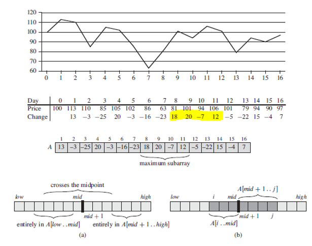

## Maximum Subarray

Given a series of points, to find the maximum subarray i.e. contiguous subarray whose values have the largest sum, can use DAC paradigm to solve. An example of this problem would be to maximize profits buying/selling a stock, given that the future stock price is known. With DAC, any contiguous subarray [i...j] must lie in exactly one of the following places:

- Entire in subarray A[low...mid] so that low <= i <= j <= mid.
- Entire in subarray A[mid +1...high] so that mid < i <= j <= high.
- Crossing the midpoint so that low <= i <= mid < j <= high.

Hence, to find the subarray that crosses midpoint, can split into two subproblems, find maximum subarrays for each subproblem and combine them.

### Profit Maximization for Stock



### Algorithm (Pseudo)

```
findCrossingMaxSubArray(A, low, mid, high) {
  leftSum = -INFINITY
  sum = 0
  for (i=mid; i >= 0; i--) {
    sum = sum + A[i]
    if (sum > leftSum) {
      leftSum = sum
      maxLeft = i
    }
  }
  rightSum = -INFINITY
  sum = 0
  for (j = mid+1; j <= high; i++) {
    sum = sum + A[j]
    if (sum > rightSum) {
      rightSum = sum
      maxRight = j
    }
  }
  return maxLeft, maxRight, leftSum + rightSum
}
```

```
findMaxSubArray(A, low, high) {
  if (low == high) return low, high, A[low]
  else {
    mid = (low + high) / 2

    // get max for complete left
    leftLow, leftHigh, leftSum = findMaxSubArray(A, low, mid)
    // get max for complete right
    rightLow, rightHigh, rightSum = findMaxSubArray(A, mid+1, high)
    // get max if crosses midpoint
    crossLow, crossHigh, crossSum = findCrossingMaxSubArray(A, low, mid, high)

    if (leftSum >= crossSum && leftSum >= rightSum)
      return leftSum
    elseif (crossSum >= leftSum && crossSum >= rightSum)
      return crossSum
    else return rightSum
  }
}
```
