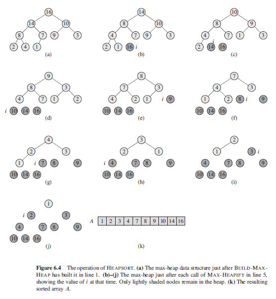

### Heapsort

Heapsort introduces an algorithm design technique using a data structure called "heap". Heap makes it an efficient priority queue. Achieves the best average and worst-case complexities with both of O(nlog2n).

Makes use of binary heap trees as follows:

- Takes an unsorted array and re-arranging it so that it satisfies the heap tree priority ordering.
- Largest item in heap is always in a[1].
- Largest item in sorted array is always in a[n].
- Swaps both items and hence, will have item at right position of the array.
- Discard largest node from heap by decrementing heapSize.
- Perform maxHeapify as new root element might violate the max-heap property.
- Second largest item will be in a[1], and its final position in sorted array is a[n-1].
- Repeat using bubble down procedure down to heapSize of 2.

### Algorithm (Pseudo)

```
heapSort(A) {
    n = A.length
    buildMaxHeap(A)
    for( i = n ; i > 1 ; i-- ) {
        swap A[1] and A[i]
        A.heapSize = A.heapSize - 1
        maxHeapify(A, 1)
    }
}
```

### Sequence of Events


