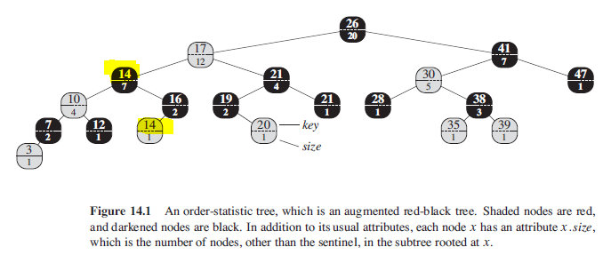

### Dynamic Order Statistics

The ith order statistic is simply the element in the set with the ith smallest key. An order statistic tree is simply a red-black tree with additional information stored in each node.
The tree can be augmented by adding "size" property to each node which contains the number of internal nodes in the subtree rooted at x (including x itself). Keys are not required to be distinct.

```
x.size = x.left.size + x.right.size + 1
```

### Figure



### Retrieving an Element with Given Rank

From above figure, key 14 is stored in black and red nodes has rank 5 and 6 respectively.

```
// returns a pointer to the node containing the ith smallest key
// in the subtree rooted at x

osSelect(x,i){
    // r refers to the rank ofnode x
    r = x.left.size + 1
    if i == r
        return x
    elseif i < r
        return osSelect(x.left,i)
    else
        return osSelect(x.right, i-r)
}
```
