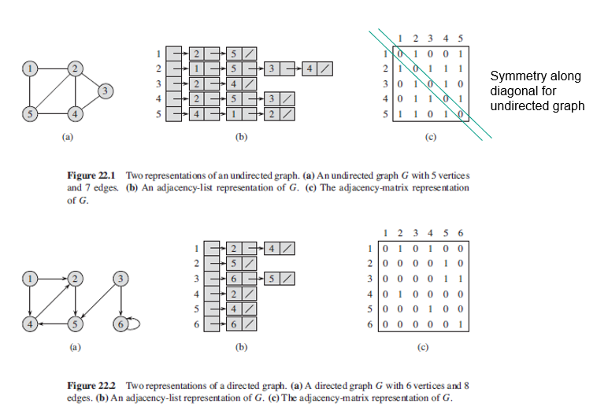

### Graphs Representations

Two standards ways to represent a directed/undirected graph G = (V,E) where V and E are arrays of vertex and edges respectively: a collection of adjacency lists or matrix. As the adjacency-list provides a compact way to represent sparse graphs i.e. |E| << |V^2|, it is usually the method of choice. For dense graphs i.e. |E| is close to |V^2|, matrix is perferred. 

#### Figure

#### Adjacency-List

Consists of an array of |V| lists, one for each vertex in V. Size of array is equal to the number of vertices. Index of the array represents a vertex and hence, size of array is |V|. Saves space as we only need to store the values for the edges. However, finding whether an edge exist between vertexes u and v is not efficient as all the connected nodes must be first explored.

For a directed graph, the sum of the lengths of all the adjacency lists is |E|. For an undirected graph, the sum of the lengths of all adjacency lists is 2|E|, since if (u,v) is an undirected edge, then u appears in v's adjacency list and vice versa. 

Adjacency lists can be readily adapted to represent weighted graph, typically given by a weight function w. The weight w(u,v) of edge (u,v) is stored in u's adjacency list with vertex v (stored as a pair). The adjacency-list representation is quite robust in that we can modify it to support many other graph variants.

#### Adjacency-Matrix

Consists of |V| * |V| matrix whereby Aij = 1 if (i,j) are elements of E, else 0. Requires |V|^2 memory, independent of the number of edges. 

For undirected graphs, has symmetry along the main diagonal as (u,v) and (v,u) represent the same edge i.e. A = A^T of its transpose. Hence, some applications would simply store the entries on and above the diagonal and cutting memory needed by half.

For representing weighted graphs, the weight w (u,v) of edge (u,v) is stored as the entry in row u and column v. If edge does not exist, can store as 0 or -INFINITY.

## Graphs

A graph is a data structure where a node can have zero or more adjacent elements. Consists of series of nodes. Terminology as follows:

- Edge: Connection between two nodes.
- Vertices: Alternative term for nodes/vertex; can have edges that coonnect to itself i.e. self-loop.
- Degree: Number of edges connected to a vertex.
- Path: Sequence of nodes such that Vi and Vi+1 are connected by an edge for 1<=i<= n-1.
- Neighbors: When two vertices are connected by an edge.
- Adjacent: Two edges that have a vertex in common.

Not all vertices have to be connected in the graph. Can have isolated nodes or separated subgraphs.

https://adrianmejia.com/data-structures-for-beginners-graphs-time-complexity-tutorial/#Depth-first-search-DFS-Graph-search

### Data Structure

  

### Types of Graphs

- Simple: Graph with no self-loops and no more than one edge connecting any pair of vertices.
- Weighted: Edges have values/cost assigned to them; if absent, can assume it is 1.
- Undirected: Edges are bi-directional i.e. can be viewed as going both ways.
- Directed (Digraphs): Edges have a direction i.e. indicated by arrows.
- Cyclic: Graph with cycles i.e. can get same node more than once.
- Acyclic: Graph without cycles.
- Connected: All nodes have at least one edge.
- Sparse: Few connections in graph.
- Dense: Many conenctions i.e. close to max number of links.
- Complete: All nodes are connected to all other nodes i.e. each node has (#nodes-1) edges.

An acyclic undirected graph is also a tree. For directed graphs, notion of connectedness has two versions:

- Weakly Connected: there is either a path from A to B or B to A.
- Strongly Connected: there are paths leading both ways.

### Weighted Graph Application

| Application      | Node/Vertex       | Edges                               | Weight                          |
| ---------------- | ----------------- | ----------------------------------- | ------------------------------- |
| Social Networks  | User              | Connection with other users         | Relationship                    |
| Airline Traffic  | Airport           | Direct flights between two airports | Distance between two airports   |
| GPS Navigation   | Road intersection | Road                                | Time taken between destinations |
| Networks Routing | Server            | Data link                           | Connection speed                |
