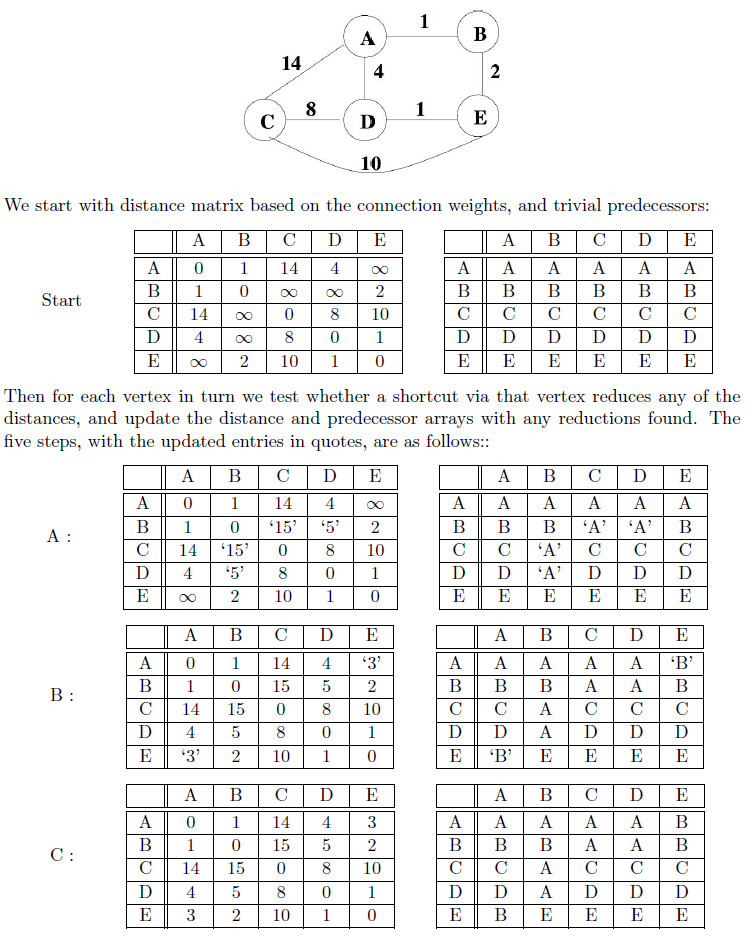
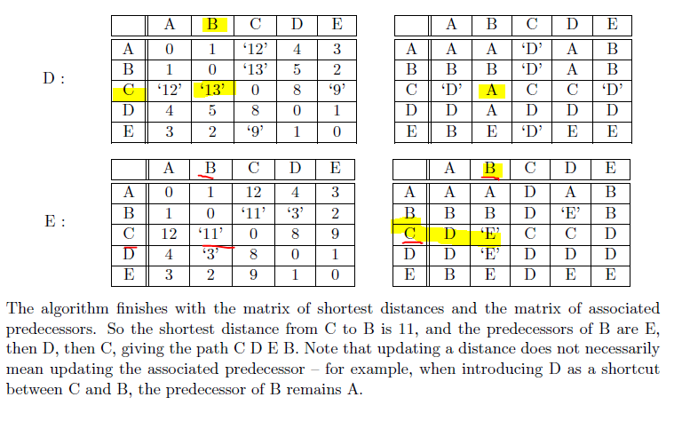

### Floyd Algorithm

Buildup from Dijkstra's algorithm, whereby it can find the shortest paths between every pair of vertices. Instead of applying Dijkstra's algorithm to every starting vertex, Floyd maintains a square matrix 'distance' which contains overestimates. To keep track of routes of shortest paths, simply introduce a second square matrix 'predecessor' to keep track of all previous vertices.

Time complexity is O(n^3) as it involves three nested for loops. Thought it has same time complexity as Dijkstra's, it will be faster as it performs fewer instructions per loop.

```
// store initial estimates and predecessors
for (each vertex s) {
    for (each vertex z) {
        distance[s][z] = weight[s][z]
        predecessor[s][z] = s
    }
}

// improve estimates by considering all possible shortcuts u
for ( each vertex u ) {
    for ( each vertex s ) {
        for ( each vertex z ) {
            if ( distance[s][u]+distance[u][z] < distance[s][z] ) {
                distance[s][z] = distance[s][u]+distance[u][z]
                predecessor[s][z] = predecessor[u][z]
            }
        }
    }
}
```

For each vertex, test where a shortcut **via the vertex** reduces any of the distances, and update the distance and predecessor arrays with any reductiosn found.




