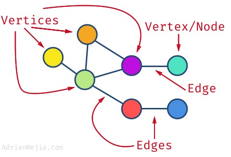

## Graphs

A graph is a data structure where a node can have zero or more adjacent elements. Consists of series of nodes. Terminology as follows:

- Edge: Connection between two nodes.
- Vertices: Alternative term for nodes/vertex; can have edges that coonnect to itself i.e. self-loop.
- Degree: Number of edges connected to a vertex.
- Path: Sequence of nodes such that Vi and Vi+1 are connected by an edge for 1<=i<= n-1.
- Neighbors: When two vertices are connected by an edge.
- Adjacent: Two edges that have a vertex in common.

Not all vertices have to be connected in the graph. Can have isolated nodes or separated subgraphs.

https://adrianmejia.com/data-structures-for-beginners-graphs-time-complexity-tutorial/#Depth-first-search-DFS-Graph-search

### Data Structure

  

### Types of Graphs

- Simple: Graph with no self-loops and no more than one edge connecting any pair of vertices.
- Weighted: Edges have values/cost assigned to them; if absent, can assume it is 1.
- Undirected: Edges are bi-directional i.e. can be viewed as going both ways.
- Directed (Digraphs): Edges have a direction i.e. indicated by arrows.
- Cyclic: Graph with cycles i.e. can get same node more than once.
- Acyclic: Graph without cycles.
- Connected: All nodes have at least one edge.
- Sparse: Few connections in graph.
- Dense: Many conenctions i.e. close to max number of links.
- Complete: All nodes are connected to all other nodes i.e. each node has (#nodes-1) edges.

An acyclic undirected graph is also a tree. For directed graphs, notion of connectedness has two versions:

- Weakly Connected: there is either a path from A to B or B to A.
- Strongly Connected: there are paths leading both ways.

### Weighted Graph Application

| Application      | Node/Vertex       | Edges                               | Weight                          |
| ---------------- | ----------------- | ----------------------------------- | ------------------------------- |
| Airline Traffic  | Airport           | Direct flights between two airports | Distance between two airports   |
| GPS Navigation   | Road intersection | Road                                | Time taken between destinations |
| Networks Routing | Server            | Data link                           | Connection speed                |
