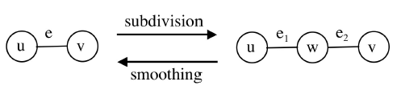
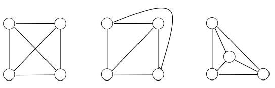

### Adjacency Matrix

A way of representing graph using two-dimensional array (N\*N matrix). Add 1 if connected and 0 or - if not connected. Only works if the graph is given explicitly i.e. we know in advance how many vertices there are and their edges.

```
  a b c d e
a 1 1 - - -
b - - 1 - -
c - - - 1 -
d - 1 1 - -
```

However, there is a potential problem whereby if the graph has many vertices, the array will be very large. If the graph has relatively few edges or sparse, the matrix will contain many 0s and it will be a waste of space to reserve so much memory for so little information.

### Mixed Implementation

Solution to above problem is to use mixed implementation. Instead of using two-dimensional array, use one-dimensional array that points to a linked list of neighbours for each vertex.

### Pointer-Based Implementation

The standard pointer-based implementation of binary trees i.e. generalization of linked lists. When each vertex/node is created, an array of neighbours big enough to accomodate all its neighbours is allocated.

### Adjacency List

One of the most common ways to represent graphs. Each node has a list of all the nodes connected to it. Can be represented using an array or hashmap. Each node includes a list (array, linked list, set, etc.) that lists its adjacent nodes. Has time complexity of O(n) as you have to go through the list.

```
a -> { a b }
b -> { c }
c -> { d }
d -> { b c }
```

```js
// as hashmap
const graph = {
  a: ["a", "b"],
  b: ["c"],
  c: ["d"],
  d: ["b", "c"],
};
```

### Relations Between Graphs

Two graphs are said to be **isomorphic** if they contain the same number of vertices with same pattern of adjacency i.e. there is bijection between their vertices which perseves the adjacency relations.

A **subgraph** of G is defined as any graph that has a vertex set which is a subet of G. A **supergraph** of G is defined as any graph which has G as a subgraph.

If nodes U and V are connected by edge E, and U and W are connected by edge E1, and W and V are connected by edge E2, then both E1 and E2 are subdivions of E. **Smoothing** refers to a process of removing vertex (W) which leaves an edge connecting the remaining adjacent vertices.

<div style="text-align: center; padding: 15px">
  
</div>

A subdivision of graph G can be defined as a graph resulting from the subdivision of edges in G. Two graphs G and H can be defined as **homeomorphic** if there is a graph isomorphism from some subdivision of G to some subdivision of H.

An **edge contraction** removes an edge from a graph and merges the two vertices previously connected by it. This can lead to multiple edges between a pair of vertices, or self-loops connecting a vertex to itself.

### Planarity

A planar graph is one that can be embedded in a plane i.e. can be drawn on a sheet of paper in such a way that no edges cross each other. This is important in applications such as printed circuit design. Though planar graphs can have edges that cross each other, they can be transformed by moving vertices or deforming the edges.

<div style="text-align: center; padding: 15px">
  
</div>

To prove a finite graph is planar, it must not contain a subgraph that is homeomorphic to, or a subdivision of K5 (fully connected graph with five vertices) or K3,3 (three vertices fully connected to three other vertices).
