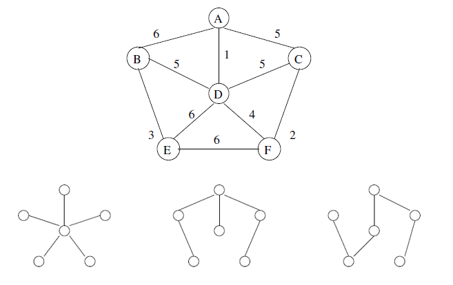

### Minimal Spanning Trees (MST)

A spanning tree of a graph is a subgraph that is a tree which connects all the vertices together, so it 'spans' the original graph but using fewer edges. Minimal refers to the sum of all the weights of the edges contained in that tree, so a minimal spanning tree has total weight less than or equal to the total weight of every other spanning tree (V-1 edges). There may not be a unique MST for a given graph.

### Pictoral Representation

Task could be supplying each house (node) with some commodity (water, gas, electricity) but with minimum digging and laying of pipes. To find the best cable layout, can use MST.




### Kruskal Algorithm

1. Sort all edges in increasing order of their weight.
2. Pick the smallest edge. Check if it forms a cycle with the spanning tree.
3. If cycle is not formed, include this edge; else discard it.
4. Repeat until there are V-1 edges in spanning tree.

#### Example


``` 
Weight   Src    Dest
1         7      6
2         8      2
2         6      5
4         0      1
4         2      5
6         8      6
7         2      3
7         7      8
8         0      7
8         1      2
9         3      4
10        5      4
11        1      7
14        3      5
```

Steps as follows:
1. Pick edge 7-6: no cycle is formed, include it.
2. Pick edge 8-2: No cycle is formed, include it. 
3. Pick edge 6-5: No cycle is formed, include it. 
4. Pick edge 0-1: No cycle is formed, include it. 
5. Pick edge 2-5: No cycle is formed, include it. 
6. Pick edge 8-6: Since including this edge results in the cycle, discard it.
7. Pick edge 2-3: No cycle is formed, include it. 
8. Pick edge 7-8: Since including this edge results in the cycle, discard it.
9. Pick edge 0-7: No cycle is formed, include it. 
10. Pick edge 1-2: Since including this edge results in the cycle, discard it.
11. Pick edge 3-4: No cycle is formed, include it. 
