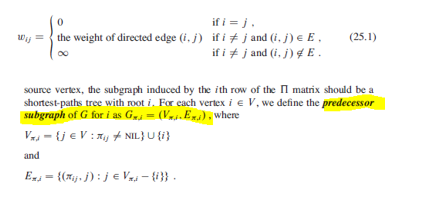

### All-Pairs Shortest Paths

This problem might arise in making a table of distances between all pairs of cities for a road atlas. For every pair of vertices, we wish to find the shortest (least-weight) path from u to v, where the weight of a path is the sum of the weights of its constituent edges. Typically would want the output in tabular form: the entry in u's row and v's column should be weight of a shortest path from u to v.

Can solve all-pairs shortest paths problem by running a single-source shortest-paths algorithm |V| times, once for each vertex as the source. However, can be done better. Using an adjacency matrix representation:
- Input: nXn matrix W, representing the edge weights of an n-vertex directed graph G = (V,E). 
- Output: nXn matrix D = (Dij), where entry Dij contains the weight of a shortest path from vertex i to j.
- Predecessor: Pij, where Pij = NIL if i=j, or if there is no path from vertex i to j. 



```
printAllPairsShortestPath(P, i, j) {
  if i == j
    print i
  elseif Pij == NIL
    print "no path from {i} to {j} exists"
  else
    printAllPairsShortestPath(P, i, Pij)
    print {j}
}
```
