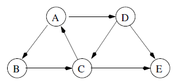

### Traversals

In order to traverse a graph i.e. systematically visit all its vertices, need a strategy for exploring which guarantees that we do not miss any edges or vertices. Graphs do not have roots like trees and hence, there is no natural place to start a traversal.

### Breadth-First Search (BFS)

For circles in graphs, would end in infinite loop. To avoid this, can create a second array "done" of booleans, where done[j] is true if we have already visited the vertex with number j. Steps as follows:

- Start from an initial vertex.
- Visit all adjacent nodes/neighbors one by one by placing them in an initially empty queue (FIFO).
- Remove first vertex from queue and one by one put its neighbours at end of queue.
- Once vertex is visited, set done[j] as true.
- Only add vertex to queue if done[j] is false.
- Repeat until queue is empty.

### Depth-First Search (DFS)

- Start from an initial vertex.
- Put vertex on a stack (FILO).
- Take the item from stack, mark it as done, look up its neighbours and add them onto the stack.
- Repeatedly pop the next vertex from the stack and repeat previous step.

A way to navigate a graph from an initial vertex by recursively calling the first adjacent node of each vertex found.

### Example

  

For unweighted graph below, using two approaches starting from A yields:

- BFS: A, B, D, C, E.
- DFS: A, B, C, E, D

Order of vertices depends on implementation.
