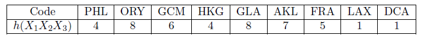
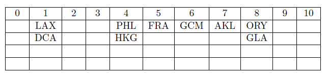
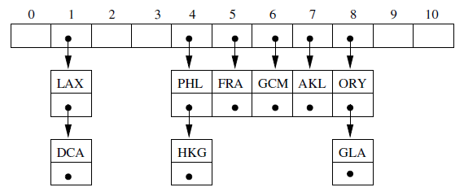

### Implementations of Table Data Structure

#### Sorted Arrays

Can use binary search which has time complexity of O(log2n) for finding, and O(n) for inserting/deleting.

#### Binary Search Trees

In the worst case, tree can be very deep and narrow, and has linear complexity when it comes to searching.

#### Hash Tables

At the expense of using more memory, can speed up table operations.

### Hash Tables

Idea is to simply put each item in an easily determined location (no need to search for it), and have no ordering to maintain when inserting or deleting items. Has advantage over time complexities of O(1) but requires more memory and more complicated to implement. Special consideration has to be taken to ensure all keys are unique to avoid collision.

To compute computational efficiency of hash table, need a way of quantifying how full the table is, so that we can compute the probabiltiy of collisions, and how much effort is needed to deal with them.

### Load Factor

For hash table of size m with n entries, load factor is simply n/m. Probability of collision occurs for next key is load factor i.e. if 25% full, probability of collision is 25% for next key. Hence, to minimize collisions, need keep load factor low (50% is often quoted as good maximum).

### Strategies for Dealing with Collisions

Given a table with 11 entries, and each key is represented as 3 character string.



#### Buckets

Reserves two-dimensional array from start. Each column is represented asa bucket in which we throw all elements giving the same result when hash function is applied. However, it has to reserve more space than required, and searching will add overhead cost.



#### Direct Chaining

Creates a linked list for the set of entries corresponding to each key. Advantage is that it does not reserve any space that will not be taken up, but lists will ahve to be traversed when searching.



#### Open Addressing

Involves finding another open location for any entry which cannot be placed where its hash function points. Easiest strategy for achieving this (linear probing) is to search for open locations by decreasing the index considered by one until an empty space is found. Better approach is to search for an empty location using secondary hash function; process is called double hashing.

#### Linear Probing

For keys having same index, linear probing reduces index until an empty space is found. Else, starts again at the end i.e. if index 4 is filled, searches index 3, and etc.

Though all keys can be inserted in a way that makes good use of space, we can no longer use same hash function to find a particular key. Deleting/inserting new keys also become complicated. Will also have clustering issues whereby if multiple keys are hitting the same primary location, the blocks/clusters needed to be tested down the index grows larger each time.

#### Double Hashing

Applies a secondary hash function to tell us how many slots to jump to look for an empty slot if a key's primary location has been filled already. One possible method is as follows:

```
hh(n) = (k/11) % 11; returns 1 if remainder is 0

where k is primary key associated with three-character code
```

When choosing secondary hash functions, in order to avoid primary clustering, one has to make sure that different keys with same primary position give different results. Also, the result cannot be a common divisor with the size of hash table i.e. hash table of size 10, and if secondary hash function returns 2/5/4/6/8, then only half of locations will be checked which might result in failure (endless loop). A simple remedy is to make sure size of hash table is a prime number.
