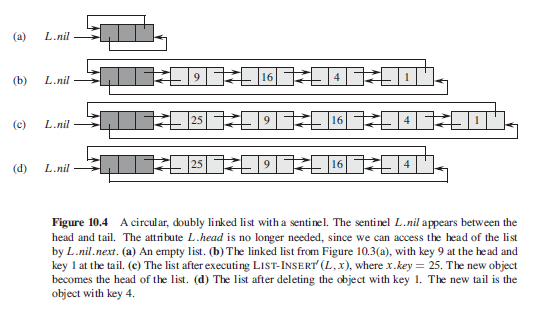

### Linked Lists

A data structure in which the objects are arranged in a linear order. Unlike an array in which the linear order is determined by the array indices, the order in a linked list is determined by a pointer in each object. 

#### Figure


#### Single

Contains pointer to next element only (no prev pointer attribute). Can virtually involve anything. Non-empty lists can be represented by two-cells; first cell contains pointer to a list element and second cell contains a pointer to either the empty list or another/next two-cell element.


#### Doubly

Doubly linked list is an object with an attribute key and two other pointer attributes: next and prev. Object may also contain satellite data. If x.prev = NIL, element x has no predecessor and is therefore the first element or head, and vice versa for x.prev. 

#### Circular

"Prev" pointer of the head of the list points to the tail, and the "next" pointer of the tail points to the head.

### Operations

```
// time complexity of O(n)
listSearch(L,k) {
  x = L.head
  while (x != NIL and x.key != k)
    x = x.next
  return x
}

// insert operation "splices" x onto the front of the linked list
// time complexity of O(1)
listInsert(L,x) {
  x.next = L.head
  if (L.head != NIL)
    L.head.prev = x
  L.head = x
  x.prev = NIL
}

// time complexity of O(n)
listDelete(L,x) {
  if x.prev != NIL
    x.prev.next = x.next  // replacing x's position with x.next
  else 
    L.head = x.next
    
  if x.next != NIL
    x.next.prev = x.prev
}
```

### Sentinels

A sentinel is a dummy object that allows us to simplify boundary conditions. By poviding a list with an object L.nil that represents NIL but has the attributes of the other objects in the list, whenever we have a reference to NIL in list code, we replace it by a reference to the sentinel L.nil. This converts a regular doubly-linked list into a **circular, doubly-linked list with sentinel**. 

L.nil appears between head and tail i.e. L.head is no longer needed as we can access the head by L.nil.next. Similarly, we can access tail by L.nil.prev. 

### Circular, Doubly-Linked List with Sentinel



```
listSearch(L,k) {
  x = L.nil.next
  while (x != L.nil && x.key != k)
    x = x.next
  return x
}

listInsert(L,x){
  x.next = L.nil.next
  L.nil.next.prev = x
  L.nil.next = x
  x.prev = L.nil
}

listDelete(L,x) {
  x.prev.next = x.next
  x.next.prev = x.prev
}
```


