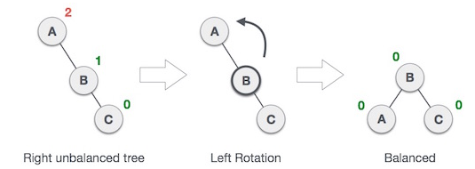
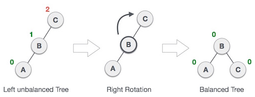
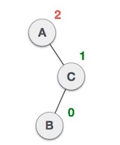

### AVL Tree

AVL tree is a self-balancing BST in which eac node maintains extra information called a balance factor whose value is either -1, 0 or +1. Balance factor is the difference between height of left subtree and right subtree of any node.

Most of BST operations (search, max, min, insert, delete) take O(h) but time complexity may increase to O(n) for a skewed BST. To have an unbalanced tree, need minimum height of 2. Rotation operations are performed on child of the first unbalanced node. Only need to rebalance the subtree rooted with first unbalanced node:
- Let newly inserted node be w.
- Perform standard BST INSERT on w.
- Starting from w, travel up and find the first unbalanced node.
- Let z be first unbalanced node, and y be the child of z (coming from path of w).
- Rebalance the tree by performing appropriate rotations on y. 

### Left Rotation (Single, RIGHT-RIGHT Case)

If tree becomes unbalanced when a node is inserted into the right subtree of the right subtree.

### Right Rotation (Single, LEFT-LEFT Case)

If tree becomes unbalanced when a node is inserted into the left subtree of the left subtree.

### Left-Right Rotation (Double, RIGHT-LEFT Case)

If tree becomes unbalanced when a node is inserted into right subtree of left subtree. Left rotation is first performed on the inserted node by making it the parent node. Right rotation is then performed on the inserted node which will result in node having left and right subtree.

### Right-Left Rotation (Double, LEFT RIGHT case)

If tree becomes unbalanced when a node is inserted into left subtree of right subtree. Right rotation is first performed on the inserted node by making it the parent node. Left rotation is then performed on the inserted node which will result in node having left and right subtree.

### Deleting Node

#### Perform Delete BST operation

#### Update Balance Factor

#### Rebalance (BF > 1)

If balanceFactor of leftChild is >= 0, do right rotation.

Else, do left-right rotation.

#### Rebalance (BF < -1)

If balanceFactor of rightChild is <= 0, do left rotation.

Else, do right-left rotation.
