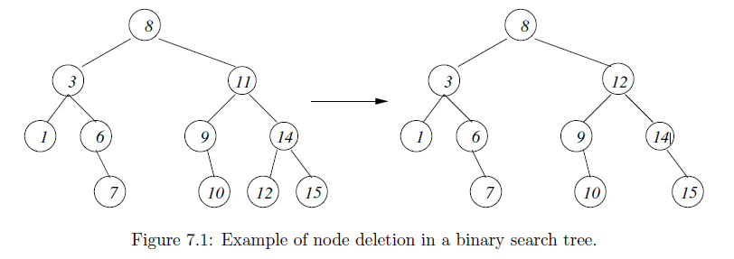
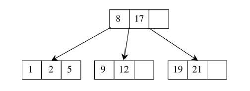

### Binary Trees

Consists of a node and at most two children, left subtree and right subtree. An empty tree is also a binary tree. Binary trees do not have simple relation between size n and height h. Maximum height with n nodes is (n-1), which happens when all non-leaf nodes have precisely one child.

#### Selectors

Breaking a non-empty tree into its constituent parts.

```
root(t)     Returns root node of binary tree
left(t)
right(t)
```

#### Operations

```
EmptyTree           Returns an empty tree
MakeTree(v,l,r)     Builds binary tree from root node with label v and two binary trees
isEmpty(t)
```

```
// making root node
Leaf(v) = MakeTree(v, EmptyTree, EmptyTree)

t = MakeTree(8, MakeTree(3, Leaf(1), MakeTree(6, EmptyTree, Leaf(7))))

root(left(left(t))) = 1
root(left(left(left(t)))) = EmptyTree
```

```
size(t) {
    if (isEmpty(t)) return 0
    else return (1 + size(left(t)) + size(right(t)))
}
```

#### Full

Each node has exactly zero or two children (but never one). A full tree is not always complete and perfect.

#### Complete

Complete Binary Trees always have minimal height for size n (log2n). Complete tree may be full but not perfect. Maximum height of binary tree with n nodes is (n-1). To create perfectly balanced trees, need to ensure previous level is full by filling nodes always from the left, before adding to next level. Any search has at most as many steps as the height of tree.

```
n       log2n
2       1
32      5
1024    10
```

#### Perfect

All levels including the last level are full of nodes i.e. all levels on tree have maximum number of nodes. A perfect tree is always complete and full. Have precisely 2^k - 1 nodes, where k is last level of tree.

#### Balanced

A tree is balanced if the left subtree and right subtree heights differ by at most 1 for every node.

### Binary Search Trees

Binary search requires sorting overhead, or maintaining a sorted array if items are deleted/inserted. With binary search trees, can speed up storing and search process without needing to maintain a sorted array. Has time complexity of O(log2n) for searching.

At each node, we want the value of that node to either tell us that we have found the required item, or tell us which of its two subtrees should search for it in. By definition, a binary search tree is one that is either empty or satifies the following conditions:

- All values occurring in left subtree are smaller than that of root.
- All vlaues occurring in right subtree are larger than that of root.
- Left and right subtrees are themselves binary search trees.
- There must be no duplicate nodes.

### Binary Trees vs Binary Search Trees

|            | Binary Tree                                                                                                                                                                | Binary Search Tree                                                                                                                                |
| ---------- | -------------------------------------------------------------------------------------------------------------------------------------------------------------------------- | ------------------------------------------------------------------------------------------------------------------------------------------------- |
| Definition | A Binary Tree is a non-linear data structure in which a node can have 0, 1 or 2 nodes. Individually, each node consists of a left pointer, right pointer and data element. | A Binary Search Tree is an organized binary tree with a structured organization of nodes. Each subtree must also be of that particular structure. |
| Structure  | There is no required organization structure of the nodes in the tree.                                                                                                      | The values of left subtree of a particular node should be lesser than that node and the right subtree values should be greater.                   |
| Operations | The operations that can be performed are deletion, insertion and traversal as it is unordered.                                                                             | As these are sorted binary trees, they are used for fast and efficient binary search, insertion and deletion.                                     |
| Types      | Complete Binary Tree, Full Binary Tree, Extended Binary Tree                                                                                                               | AVL Trees, Splay Trees, Tango Trees, T-Trees.                                                                                                     |

### Building BST

When building BST, one naturally starts with root and adds further new nodes as needed. For insertion:

1. If given tree is empty, assign new value to root and leave left/right subtrees empty.
2. If is non-empty, insert a node on left if is lesser, right if greater, error if equal.

```
insert(v,bst) {
  if ( isEmpty(bst) )
    return MakeTree(v, EmptyTree, EmptyTree)
  elseif ( v < root(bst) )
    return MakeTree(root(bst), insert(v,left(bst)), right(bst))
  elseif ( v > root(bst) )
    return MakeTree(root(bst), left(bst), insert(v,right(bst)))
  else error(`Error: violated assumption in procedure insert.')
}
```

For large database, it is more efficient to modify given tree, rather than to construct a whole new tree. Can be easily done using pointers.

### Searching BST

When searching, have to compare the item being looked for with the root, and then keep 'pushing' the comparison down into left or right subtree depending on the result of each root comparison, until a match is found or leaf is reached:

- If tree is empty, return false.
- If value is equal to root, return true.
- If value is smaller than root, search left sub-tree.
- If value is greater than root, search right sub-tree.
- Repeat until value is equal to current node.

```
isIn(value v, tree t) {
  while ( (not isEmpty(t)) and (v != root(t)) )
    if (v < root(t) )
      t = left(t)
    else
      t = right(t)
  return ( not isEmpty(t) )
}
```

### Deleting Nodes from BST

Algorithm as follows:

- If node in question is a leaf i.e. no subtrees, remove it.
- If only one of the node's subtrees is non-empty, 'move up' the remaining subtree.
- If node has two non-empty sub-trees, find the 'left-most' node occurring in the right sub-tree. Use this node to overwrite the one that is deleted.

Last part works as left-most node in right sub-tree is guaranteed to be bigger than all nodes in left sub-tree.



```
smallestNode(tree t) {
  // Precondition: t is a non-empty binary search tree
  if ( isEmpty(left(t) )
    return root(t)
  else
    return smallestNode(left(t));
}

removeSmallestNode(tree t) {
  // Precondition: t is a non-empty binary search tree
  if ( isEmpty(left(t) )
    return right(t)
  else
    return MakeTree(root(t), removeSmallestNode(left(t)), right(t))
}

delete(value v, tree t) {
  if ( isEmpty(t) )
    error(`Error: given item is not in given tree')
  else
    if ( v < root(t) ) // delete from left sub-tree
      return MakeTree(root(t), delete(v,left(t)), right(t));
  else if ( v > root(t) ) // delete from right sub-tree
    return MakeTree(root(t), left(t), delete(v,right(t)));
  else // the item v to be deleted is root(t)
    if ( isEmpty(left(t)) )
      return right(t)
  elseif ( isEmpty(right(t)) )
    return left(t)
  else // difficult case with both subtrees non-empty
    return MakeTree(smallestNode(right(t)), left(t), removeSmallestNode(right(t))
}
```

### Traversing BST

There are different ways of traversing a binary tree, depending on the order that the nodes are are visited: in-order, pre-order, and post-order.

#### In-Order Traversal

### Checking Binary Tree is Binary Search Tree

For checking binary trees, check if all nodes in left sub-tree are smaller than root and themselves form a binary search tree, and right sub-tree are bigger than root and themselves form a binary search tree.

### Balancing Binary Search Trees

In extreme cases where new items are being added in ascending order, the tree will be one with long branch off to the right, with height n >> log2n. Can rebalance binary trees from time to time using tree rotations. Typically, such rotations would need to be applied to many different sub-trees of a full tree to make it perfectly balanced.

### Self-Balancing AVL Trees

Self-balancing binary search trees avoid the problem of unbalanced trees by automatically rebalancing tree throughout the insertion process to keep height close to log2n at each stage.

### B-Trees

Generalization of self-balancing binary search tree in which each node can hold more than one search key and have more than two children. Structure is designed to allow more efficient self-balancing, and offers advantages when node data needs to be kept in external storage such as disk drives. Defintion is:

- Every node has at most m children.
- Every non-leaf node (except root) has at least m/2 children.
- Root node has at least two children.
- Non-leaf node with c children contains c-1 search keys which act as separation values to divide its subtrees.
- All leaf nodes appear in the same level and carry information.


