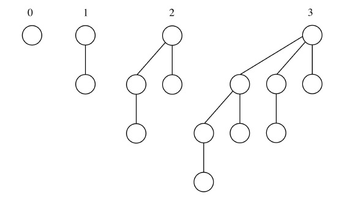

### Heap Trees

Binary trees can be stored with the help of pointer-like structures, in which each item contains references to its children. For complete binary trees, there is a useful array based alternative.

#### Storing Binary Trees as Arrays

- Not efficient if tree is not complete as it involves reserving space in array for every possible node in tree.
- Keep binary search tree balanced is difficult.
- Node insertion and deletion requires shifting large portions of array.

#### Implementing Priority Queues using Binary Heap Trees

While most queues in every-day life operate on first come, first served basis, it is sometimes important to be able to assign a priority to items in queue and serving highest priority first i.e. hopsital casualty department. Queues can be implemented efficiently by **binary heap trees**:

- Node labels (previously search keys) become numbers representing priority of each item.
- Insertion/deletion becomes efficient (one element) without having to keep whole tree sorted.
- Highest priority item will always be found at root of tree.

A binary heap tree is a complete binary tree that satisfies the following conditions:

- Is an empty tree.
- Priority of root is higher than/equal to that of its children.
- Priority of every node is higher than/equal to that of all its descendants.
- Left and right subtrees of root are heap trees.

#### Binary Search Trees vs Binary Heap Trees

- BST is an ordered data structure while Heap Trees are not.
- Biggest number occurs at root for Heap Trees rather than at right-most node.
- Subtrees connected to a parent node play different roles and are interchangeable in Heap Trees.

#### Operations

In order to develop algorithms using an array representation, need to allocate memory to keep track of largest position that has been filled so far i.e. number of nodes. Inserting requires "bubbling up" the new element into a valid position by comparing its priority with that of its parent; if it has higher priority, it is exchanged with parent. Deleting requires "bubbling down" of parent node. Both insertion and deletion takes O(log2n) steps which is equivalent to height of tree.

```
int MAX = 100       // Maximum number of nodes allowed
int heap[MAX+1]     // Stores priority values of nodes of heap tree
int n = 0           // Largest position that has been filled so far
```

```
insert(int p, array heap, int n)
delete(int i, array heap, int n)
int root(array heap, int n)
boolean heapEmpty(array heap, int n)
```

```
bubbleDown(int i, array heap, int n) {
    if ( left(i) > n )          // no children
        return
    elseif ( right(i) > n )     // only left child
        if ( heap[i] < heap[left(i)] )
            swap heap[i] and heap[left(i)]
        else // two children
    if ( heap[left(i)] > heap[right(i)] and heap[i] < heap[left(i)] ) {
        swap heap[i] and heap[left(i)]
        bubbleDown(left(i),heap,n)
    }
    elseif ( heap[i] < heap[right(i)] ) {
        swap heap[i] and heap[right(i)]
        bubbleDown(right(i),heap,n)
        }
    }
}
```

#### Building Binary Heap Tree

Rearranging an array of items into a heap tree form can be done more efficiently using "bubble down". For n items in an array:

- Items with index n/2 will be leaves.
- All non-leaf items may be exchanged with their children i.e. bubbling down.

```
heapify(array a, int n) {
    for( i = n/2 ; i > 0 ; i-- )
        bubbleDown(i,a,n)
}
```

Time complexity of heapify is O(n) as compared to inserting items one at a time which has O(nlog2n).

### Binomial Heaps

Similar to binary heap, but has advantage of more efficient procedures for insertion/merging. A binomial heap is implemented as a collection of binomial trees and defined recusrively as follows:

- Binomial tree of order 0 is a single node.
- Binomial tree of order k has a root node with children that are roots of binomial trees of orders k-1, k-2, ..., 2, 1, 0 (in that order).
- Binomial tree of order k has height k, contains 2^k nodes.
- There can only be zero or one binomial tree of each order.
- Each constituent binomial tree must satisfy the priority ordering property.



Most important operation for binomial heaps is merge as it can be used as a sub-process for most other operations. Has O(log2n) time complexity which is better than O(n) complexity of merging binary heaps.

### Fibonacci Heaps

Structure is more flexible and efficient and hence, allows to have better time complexities but come at cost of more complexity:

- Trees do not have fixed shape.
- In worst case, every element in heap can be in a separate tree.
- Roots of all trees are stored using a circular doubly linked list.
- Efficiency is achieved by performing many operations in lazy manner.

### Time Complexities Comparison

| Heap Type | Insert   | Delete   | Merge    | Heapify | Up Priority |
| --------- | -------- | -------- | -------- | ------- | ----------- |
| Binary    | O(log2n) | O(log2n) | O(n)     | O(n)    | O(log2n)    |
| Binomial  | O(1)     | O(log2n) | O(log2n) | O(n)    | O(log2n)    |
| Fibonacci | O(1)     | O(log2n) | O(1)     | O(n)    | O(1)        |
